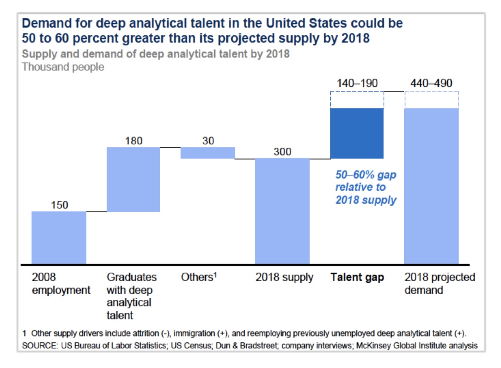
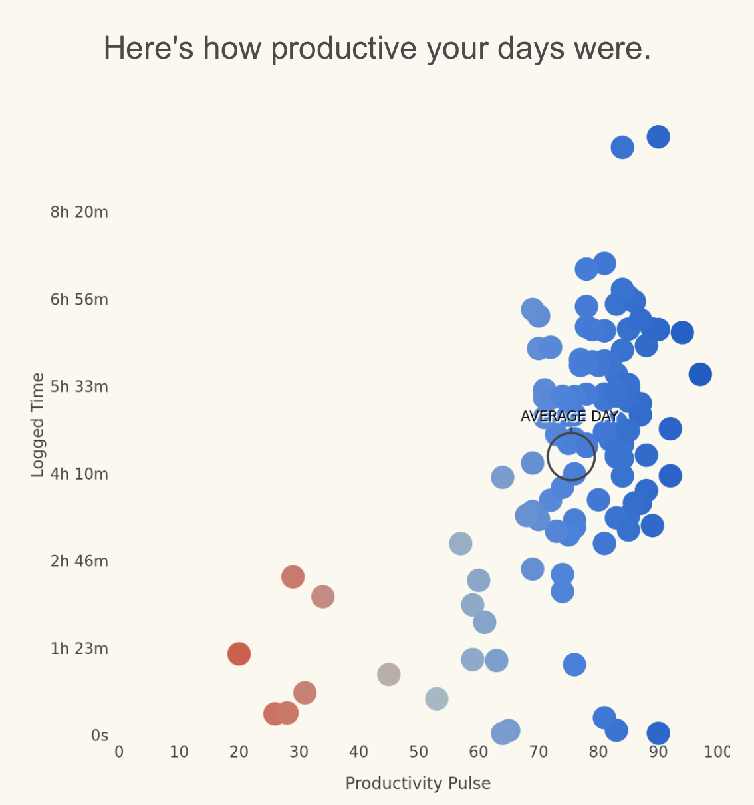

```{r setup, include = FALSE}
# suppress version number in the subdirectory name
options(htmltools.dir.version = FALSE)

#load required packages
library(xaringanthemer)
library(jcolors)
```

```{r xaringan-themer, include = FALSE}
# specify slide font and base color
mono_accent_inverse(
  base_color = "#69c3f4",
  header_font_google = google_font("Josefin Sans"),
  text_font_google   = google_font("Montserrat", "300", "300i"),
  code_font_google   = google_font("Droid Mono"))
```



---

.pull-right[

]

.pull-left[
#### The Audience

* Post-docs interested in data science. 
]

---

.right-column[

]

---

.pull-left[ 
#### The Audience

* Users of the software. 

]

.pull-right[

]

---

.pull-left[ 
#### The Audience

* Users of the software. 

#### What is being communicated?

* The relationship between productivity and amount of time spent on the computer. 

]

.pull-right[

]

---

.pull-left[ 
#### The Audience

* Users of the software. 

#### What is being communicated?

* The relationship between productivity and amount of time spent on the computer. 

#### Strengths

* Redundant coding. 

* Diverging color scale.

* Average day.

]

.pull-right[

]

---

.pull-left[ 
#### The Audience

* Users of the software. 

#### What is being communicated?

* The relationship between productivity and amount of time spent on the computer. 

#### Strengths

* Redundant coding. 

* Diverging color scale.

* Average day.

#### Areas for improvement

* Cognitively demanding y-axis. 

* Grid lines.

* Point overlap. 

]

.pull-right[

]
---


---
class: inverse, middle, center

# The END!
